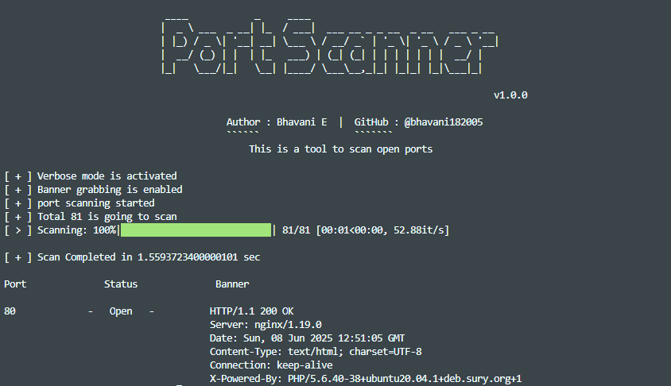

</img>

# Multi-Threaded port scanner
This is a port scanner which has multi-threaded scan using concurrent.futures .

## Installation : 

Step 1: Clone the repo by the following commands.

```bash

git clone https://github.com/bhavani182005/port-scanner.git

cd port-scanner

```
Step 2: Install requirements by the following commands.

```bash

pip3 install -r requirements.txt

```

Step 3: Run the tool by the following command.

- option 1: Run as a module

    ```bash

    python3 -m portscanner

    ```
- Option to install it as a tool using setup.py [recommended]

    ```bash

    pipx install .

    ```

## Usage: 
```
    [Description]: This is a simple port scanner which can be used to identify the open ports developed by Bhavani E.
        Usage : portscanner.py -d domain  -p [ ports eg: (80,443,8080,8088) or 1-1000 to specify the range] [ options ]   

            [Options]
                    -d , --domain                        : Domain to scan [ Mandatory ]
                    -p , --ports (80,443,8080,8088)      : Only specified port(s) to scan. If no ports specified all well known ports will scanned.
                    -p-                                  : To scan all the ports
                    -b , --banner-grabbing               : Enable banner grabbing
                    -v , --verbose                       : To enable verbose mode.
                    -t , --threads                       : Threads (default : 40)
                    -h , --help                          : help menu.
```

## Sample output:
```bash
portscanner -d testphp.vulnweb.com -v -b
```
</img>

